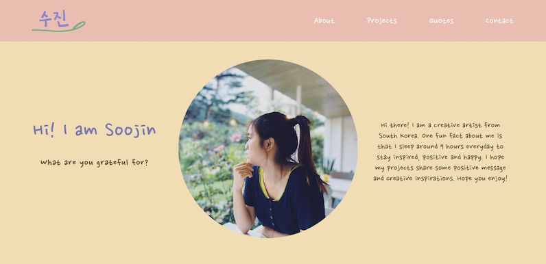

# Commlab Portfolio
This is my personal website I made to share four projects I worked on for Communications Lab class. Please enjoy watching four creative projects that are film, comic, sound, and video projects. 

### [Link to the website](https://soojin-lee0819.github.io/portfolio/).

## Direct Link to Project Websites 

### [Instead, Distance Socialize](https://soojin-lee0819.github.io/Soojin_Lee0819.github.io/).
This is the website for 30 Minute Film Festival (Creating film in 30 minutes from ideation to post production). It shares a message to stay safe, connected, and socialize safely.

### [Sometimes Life is Unpredictable](https://hasin-shabbir.github.io/comicStrip/).
This is an interactive web-comic project. It shares a message that life is unpredictable but it is important to maintain a positive outlook and assume good wills.

### [Hear our Spirit!](https://soojin-lee0819.github.io/soundproject2/).
This is a music-video sound project. It invites viewers to experience life on NYUAD during COVID-19 through audio.

### [How to Self-Care](https://aisahodzic.github.io/Video%20Project/mainPage.html).
This is a stop-motion video project. It encourage self-care practices and shares some fun self-care ideas.
